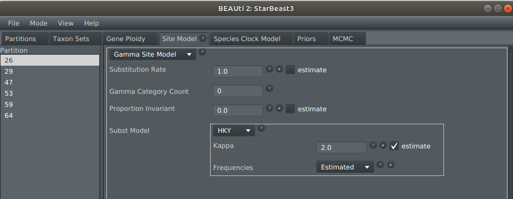

# StarBeast3

[BEAST 2](http://beast2.org) based package for Bayesian multispecies coalescent (MSC) analyses using efficient and parallelised MCMC operators.

## Installation

* Install BEAST 2 (available from [http://beast2.org](http://beast2.org)).
* Add https://raw.githubusercontent.com/CompEvol/CBAN/master/packages-extra.xml to your package repositories
	* Open BEAUti, select `File => Manage packages` menu. The package manager dialog pops up.
	* Click the `Package Repositories` button. The repositories dialog pops up.
	* Click `Add URL`
	* Enter `https://raw.githubusercontent.com/CompEvol/CBAN/master/packages-extra.xml` in the entry, and click `OK`
	* Click the `Done` button, and starbeast3 should appear in the package list.
* Install starbeast3 package through the [package manager](http://www.beast2.org/managing-packages/) (this may automatically install some other package as well)

## Using StarBeast3

1. Open BEAUti, and select the StarBeast3 template  (menu `File/Templates/StarBeast3`).

2. Import one or more alignments using `File/Import Alignment` (example session: import `26.nex` and `29.nex`, which are located in the `beast/examples/nexus/` directory). Each alignment will serve as the data for 1 gene tree.

3. To create a species-to-taxon mapping, open the `Taxon sets` tab. For the example session, press `Guess` and then split on character `_` and take group `2`.


4. To define the ploidy of each gene tree, open the `Gene Ploidy` tab. The `Gamma Parameter` is the mean effective population size (denoted by &mu;N in main article) and is estimated by default.

5. Set the site model of each gene tree in the `Site Model` tab. By default, the `Substitution Rate` (denoted by &nu; in article) is estimated for each gene tree.



6. Select a clock model using the `Clock model` tab. 

    -   Under the `Species Tree Strict Clock`, every branch in the species tree has the same substitution rate. 
    -   Under the `Species Tree Relaxed Clock`, each species tree branch has an independently-and-identically distribution substitution rate with a LogNormal(mean = 1, logSD = Stddev) distribution, where Stddev is estimated (denoted by &sigma; in manuscript). The substitution rate of each gene tree branch are then inherited from the species tree. 

The `Clock.rate` can also be estimated, but this is not recommended unless time calibration data is available. 


7. Other priors, including the species tree prior, can be configued using the `Priors` tab.


8. Save the XML template using `File/Save`

9. Run BEAST on the saved XML file using
        ```beast/bin/beast -threads N starbeast3.xml```
where `N` is the number of threads allocated to the parallel gene tree operator. The gene trees are partitioned into `N` threads and operated on independently.

10. MCMC convergence can be measured using Tracer (see [https://www.beast2.org/tracer-2/](https://www.beast2.org/tracer-2/))


11. The MSC model (including the species tree, gene trees, effecive population sizes, and branch rates) can be visualised using UglyTrees (see [https://uglytrees.nz/](https://uglytrees.nz/)).


Also see tutorial for *BEAST (see [StarBEAST tutorial](https://taming-the-beast.org/tutorials/StarBeast-Tutorial/)).

## Questions about StarBeast3

BEAST user list: [https://groups.google.com/forum/#!forum/beast-users](https://groups.google.com/forum/#!forum/beast-users)

Jordan Douglas: [jordan.douglas@auckland.ac.nz](jordan.douglas@auckland.ac.nz)

Remco Bouckaert: [rbouckaert@auckland.ac.nz](rbouckaert@auckland.ac.nz)


## References

The preprint for StarBeast3 is available at [doi: https://doi.org/10.1101/2021.10.06.463424](https://doi.org/10.1101/2021.10.06.463424)


*Also see*

**Optimised relaxed clock package:** Douglas, Jordan, Rong Zhang, and Remco Bouckaert. "Adaptive dating and fast proposals: Revisiting the phylogenetic relaxed clock model." PLoS computational biology 17.2 (2021): e1008322.

**Tracer** Rambaut, Andrew, et al. "Posterior summarization in Bayesian phylogenetics using Tracer 1.7." Systematic biology 67.5 (2018): 901.

**UglyTrees** Douglas, Jordan. "UglyTrees: a browser-based multispecies coalescent tree visualizer." Bioinformatics 37.2 (2021): 268-269.

**BEAST 2:** Bouckaert, Remco, et al. "BEAST 2.5: An advanced software platform for Bayesian evolutionary analysis." PLoS computational biology 15.4 (2019): e1006650.

**StarBeast2**: Ogilvie, Huw A., Remco R. Bouckaert, and Alexei J. Drummond. "StarBEAST2 brings faster species tree inference and accurate estimates of substitution rates." Molecular biology and evolution 34.8 (2017): 2101-2114.

