# StarBeast3 tutorial: Multispecies coalescent divergence dating with fossil leaves

In this tutorial, we will explore primate multilocus genomic data using a multispecies coalescent model. We will demonstrate how to perform this analysis using StarBeast3 and how the model can be visualised and interpreted.

## Dependencies

Please install [BEAST 2.7.5](https://www.beast2.org/) or greater before starting the tutorial.

## 1. Primates

The bush babies (family: Galagidae) are a group of nocturnal primates native to sub-Saharan Africa. They are a sister group of the lorises (family: Lorisidae).

Pozzi et al. 2014 compiled a genomic dataset sampled from 30 primates, including bush babies and lorises. 
Their original dataset contains 27 partitions. 
In this tutorial, we will consider just 3 of these loci. They also compiled fossil data, which we will use in this tutorial. We will estimate the phylogeny of these three 3 loci, plus a 4th 'fossil' locus that captures time calibration data. These four gene trees will be constrained within a single species tree phylogeny.

**Step 1.1.** Download the genetic data .nex file [here](https://raw.githubusercontent.com/rbouckaert/starbeast3/master/workshop/data/primates_3loci.nex) and the fossil .fasta file [here](https://raw.githubusercontent.com/rbouckaert/starbeast3/master/workshop/data/fossils.fasta).

## 2. Set up multispecies coalescent method in BEAUti

First, we will load the dataset into the StarBeast3 BEAUti template.

**Step 2.1.** Launch BEAUti

**Step 2.2.** Install the latest version of **StarBeast3**. This is done through `File => Manage Packages`. 
Select `starbeast3` from the list and press the `Install/Upgrade` button. 
This automatically installs the packages that **StarBeast3** depends on, such as **ORC**.
Close the package manager. You will need to restart BEAUti for this to take effect.

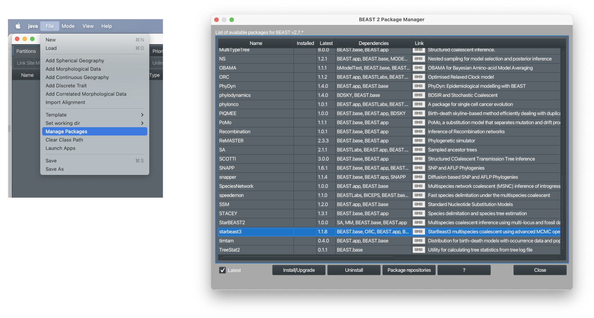

By the way, if you wonder why the screen shot is in dark mode, this is because the Dark theme has been selected. You can find this under the menu `View => Theme Dark`.

**Step 2.3.** Initialise the StarBeast3 template. `File => Template => StarBeast3`.

**Step 2.4.** Load the two datasets `primates_3loci.nex` and `fossils.fasta` into BEAUti. `File => Import alignment`, or drag and drop. Specify `nucleotide` as the data type. You should see 4 partitions appear - ADORA3, RAG2, SIM1, and fossils. There will be 33 taxa - 30 are extant and 3 are fossils.

Next, we will group individuals together into species. Some of the taxa were initially assigned into the wrong species in previous studies. For example two primates were assigned as *Galagoides demidoff*, however phylogenetic analyses suggested they were in fact different species (Douglas and Bouckaert, 2022b). Some taxa have therefore been relabelled for the purpose of this tutorial.

**Step 2.5.** Open the Taxon Sets tab. Press `Guess => Split on character => _ => and take groups 1-2 => OK`. Now you should see our 33 taxa have been grouped into 28 species.

**Question 2.1.** What could be the possible reasons for taxa being assigned to the wrong species? 

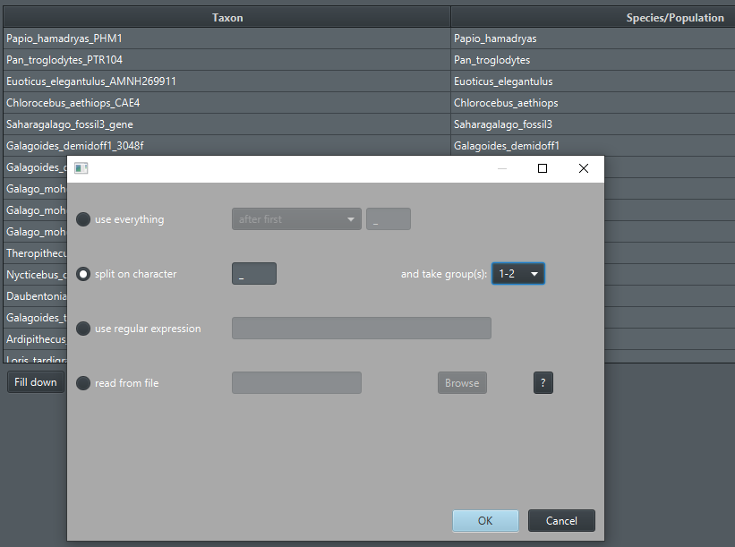

We will use the HKY site model on each locus. This method will compare several nucleotide substitution models.

**Step 2.6.** Open the Site Model tab. Select the ADORA3 partition, and then select `HKY` from the `Subst Model` dropdown. Highlight all 3 genetic loci on the left hand side (shift + click) and select Clone from 'ADORA3', and then OK. We will leave the fossil partition as default. We will not use gamma rate heterogeneity in this tutorial because it will slow down the performance.

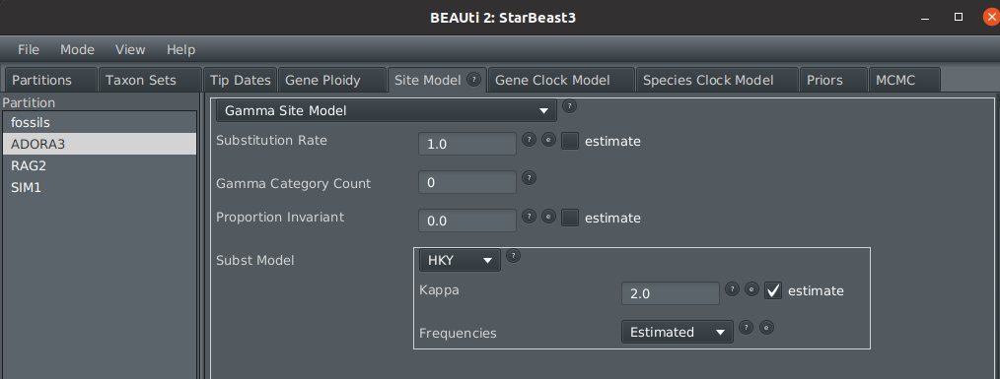

By default, each locus will have its relative clock rate estimated and the organisms are diploid (ploidy=2). You can confirm these on the `Gene Clock Model` and `Gene ploidy` tabs. The clock rate will have no meaning in the case of the fossil partition.

Now, we will estimate the molecular substitution rate of the species tree in units of substitutions per site per million years. We will also apply a relaxed clock model so that the clock rate can vary across lineages.

 **Step 2.7.** Open the `Species Clock Model` tab and select `Species Tree Relaxed Clock`. Tick the `estimate` box next to `Clock.rate` so that the clock rate is estimated.

We need to select a prior for the molecular substitution rate. Chintalapati et al. 2020 estimated primates have around 1e-9 - 5e-9 mutations per site per year. This is equal to 0.001-0.005 mutations per site per million years. We will use this to inform a prior distribution on the clock rate: LogNormal(mean = 0.003, sd = 1).

 **Step 2.8.** Open the `Priors` tab, and assign a LogNormal(M=0.0025, S=1) prior to `SpeciesTreeRelaxedClockRate.Species`. Ensure that `Mean in Real Space` is ticked.

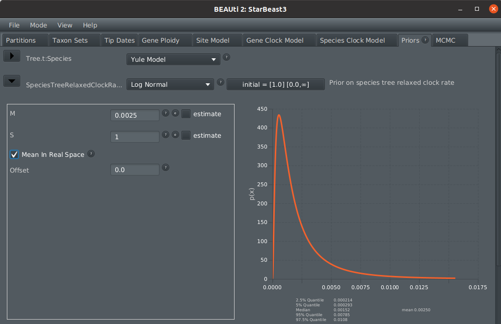

We will use the fossilised birth death (FBD) model as a tree prior. This model will account for the birth and death of lineages, including the three fossils. Each fossil will be considered as either a) a direct ancestor, or b) an extinct cousin. 

 **Step 2.9.** Select the `FBDModel` as a Tree prior (at the top of the priors tab). Assign a LogNormal(M=1, S=3) prior to `diversificationRateFBD.t:Species`. Ensure that `Mean in Real Space` is ticked. We will also assume that the species extinction rate is slightly less than the speciation rate: assign a Beta(alpha=5, beta=1) prior to `turnoverFBD.t:Species`.
 
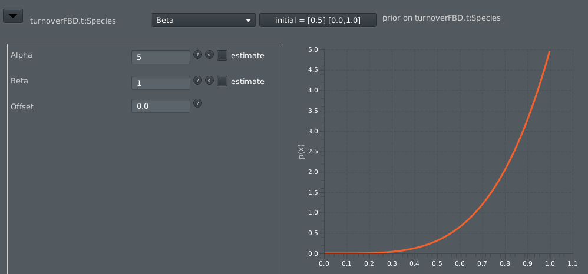

 **Step 2.10.** Assign an uninformed LogNormal(M=1, S=2) prior to `popMean`. Ensure that `Mean in Real Space` is ticked. 

Lastly, we need to incorporate time calibration data. We will do this by estimating the heights of three fossils, which are leaves in the tree. Each fossil is associated with a prior distribution of ages, and is constrained within a separate clade in the tree. We will consider just three fossils in this tutorial, but for a longer list please see Pozzi et al. 2014.

| Fossil | Clade | Age| Prior | Reference |
|--|--|--|--|--|
| 1 *Ardipithecus* | *Homo sapiens*, *Pan troglodytes* | 5.2 mya | LogNormal(M=5.4, S=0.1) | Haile-Selassie et al. 2001 |
| 2 *Sivapithecus* | *Homo sapiens*, *Pan troglodytes*, *Pongo pygmaeus*, **Fossil 1** | 12.5 mya | LogNormal(M=14.75, S=0.1) | Kelley 2002 |
| 3 *Saharagalago* | *Arctocebus calabarensis*, *Perodicticus potto*, *Loris tardigradus*, *Nycticebus coucang*, *Nycticebus bengalensis*, *Nycticebus pygmaeus* | >36.9 mya | LogNormal(M=47, S=0.1) | Seiffert et al. 2003 |

**Step 2.11.** To set the initial date of each fossil, open the `Tip Dates` tab. Enable `Use tip dates`. Select `Before the present` in the second dropdown box. Find fossil1, fossil2, and fossil3 on the list and set their initial `Date` to the ages specified above.

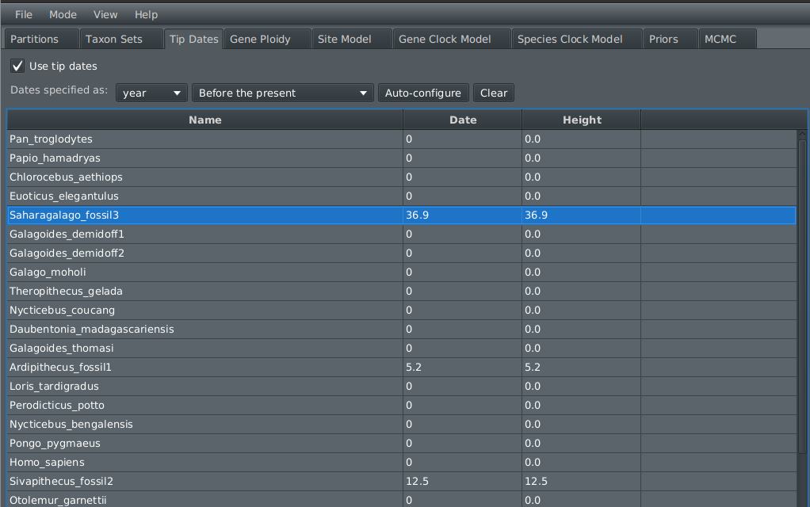

Repeat the following four steps for each fossil in the table above:

**Step 2.12.** We need to add a prior distribution for each fossil age.  Open the `Priors`  tab. For each fossil, first press `+ Add Prior` and select `StarBeast3 MRCA Prior`. Then move the fossil over to the right hand side, and give the Taxon set an appropriate label (e.g., fossil1 can be called Ardipithecus). Press OK. 

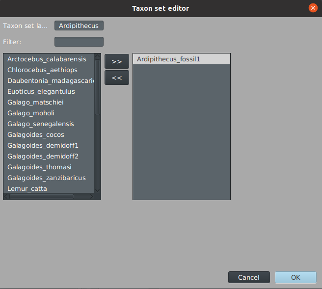

**Step 2.13.** Find the fossil on the list of priors. Open the dropdown and select a LogNormal prior. Expand its settings by pressing the triangle. Enter the M and S values for the prior specified in the table above, ensuring that `Mean in Real Space` is ticked. Tick the `**Tipsonly**` box (at the bottom). 

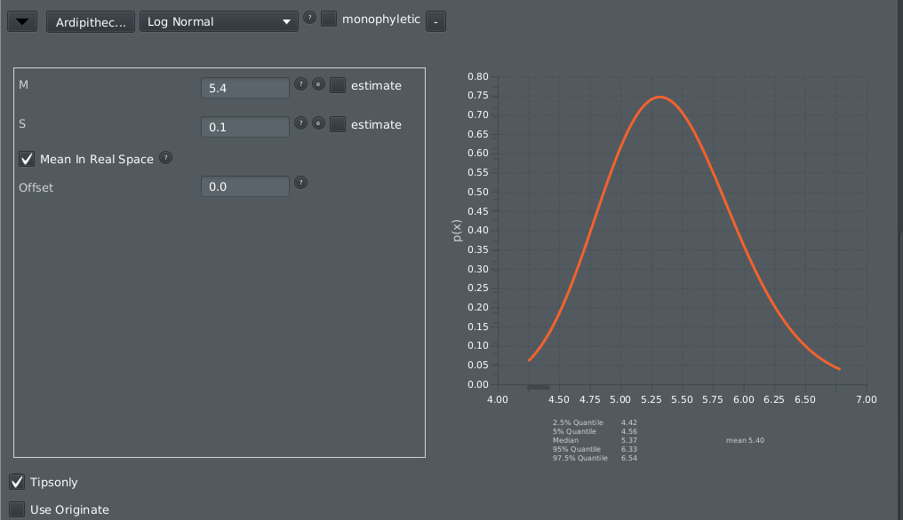

**Step 2.14.** We also have to specify the clade that each fossil belongs to. For each fossil, press `+ Add Prior` once more, and select `StarBeast3 MRCA Prior`. Move the **fossil and all other clade members** to the right hand side, and assign a suitable name. For example, move fossil1, sapiens, and troglodytes to the right, and save as `Ardipithecus_clade`.

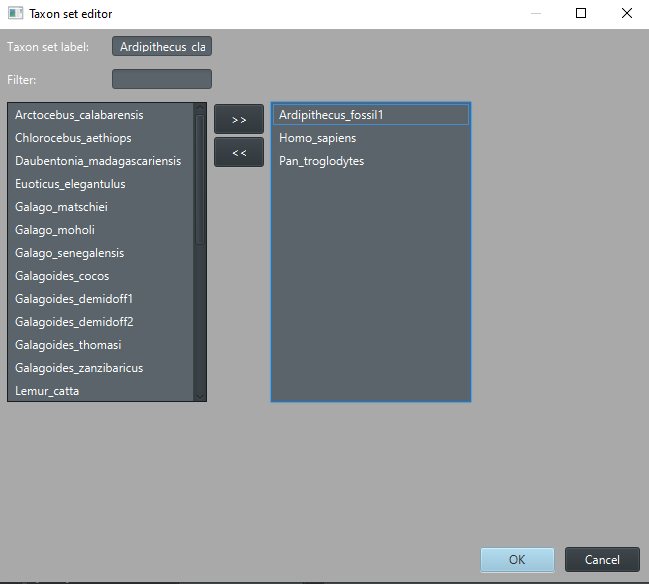

**Step 2.15.** Find the clade on the list of priors. Tick the `Monophyletic` box (at the bottom). We will **not** give these a height prior distribution.

**Step 2.16.** Increase the MCMC chain length to 20 million states. Open the `MCMC` tab, then set `Chain Length = 20000000`.

Now we are done! We just have to save the file.

**Step 2.17.** Save the XML file `File => Save`. 

If you encounter any issues along the way, you can download the pre-generated XML file [here](data/primates.xml).

## 3. Running BEAST 2

Now, we will perform Bayesian inference using BEAST 2. 

**Step 3.1.** In the command line, or using the graphical user interface, run beast on the primates.xml file. It should take around 10 minutes for the experiment to finish, however you can begin the next steps while you wait.

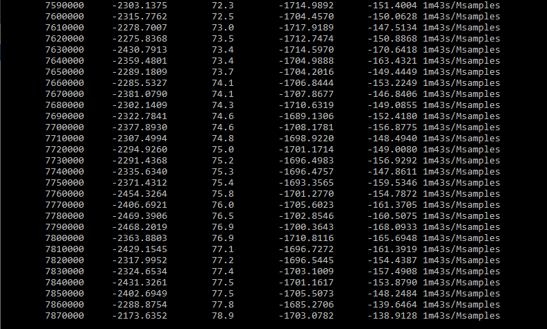

If you encounter any issues along the way, you can download the pre-generated output files [here](results).

## 4. Interpreting results

First, we will view the MCMC chain of multispecies coalescent trees. We will use UglyTrees to do this. By default, the width of each species tree node is proportional to the effective population size.

**Step 4.1.** Go to [UglyTrees](www.uglytrees.nz)  and load species.trees as a species tree. Load ADORA3.trees, RAG2.trees, and SIM1.trees as gene trees. Press `Draw Trees`. Use the arrow keys (left and right) to navigate through the posterior chain of estimated trees.  

**Question 4.1.** Can you find the three fossils on the tree?

**Question 4.2.** Can you spot any coalescent events that occurred in a lineage older than the common ancestor of the two species?

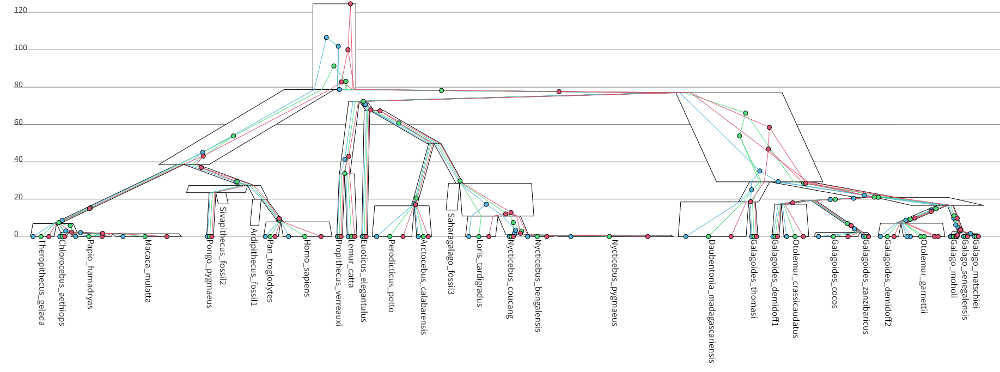

Now, we will diagnose the MCMC chain and determine if it has converged.

**Step 4.2.** Open Tracer and load the starbeast3.log file. Look at the effective sample sizes (ESS) and the traces. 

**Question 4.3.** Do you think the MCMC chain has converged? How can you tell? If it has not converged, keep running it for a little longer. 

**Question 4.4.** What is the estimated age of the tree (millions of years)? What is the 95% credible interval?

**Question 4.5.** Do the three partitions have different HKY model parameters - i.e., are their transition-transversion ratios (kappa) and nucleotide frequencies similar or different?

**Question 4.6.** Which partition is evolving the slowest, i.e., the smallest clock rate? ADORA3, RAG2, or SIM1?

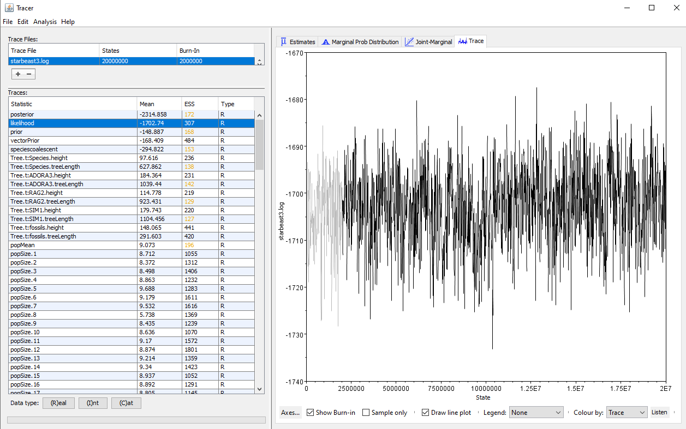

Finally, we will summarise the species tree as a maximum clade credibility (MCC) tree.

**Step 4.3.** Open the BEAST 2 Tree Annotator tool. Generate an MCC tree from the species.trees file, setting **heights** to `mean`. Use FigTree or UglyTrees or your favourite software to view the summary tree.

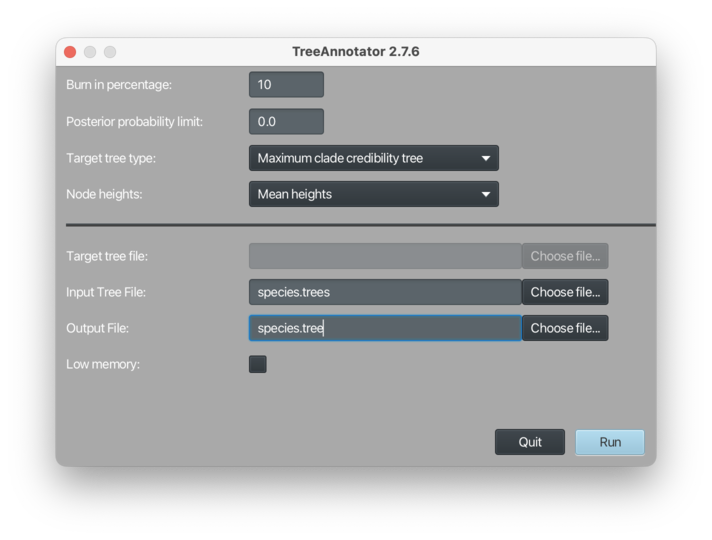

A pre-generated summary tree file is [here](results/species.tree).

**Question 4.7.** Which lineages have evolved the fastest (i.e., highest clock rates)? Which ones have evolved the slowest?

**Question 4.8.** What are the clade supports like on this tree? Is the phylogeny well-supported? What could be done to increase the clade support?

## References

Bouckaert, Remco, et al. "BEAST 2.5: An advanced software platform for Bayesian evolutionary analysis." _PLoS computational biology_ 15.4 (2019): e1006650.

Douglas, Jordan, Cinthy L. Jiménez-Silva, and Remco Bouckaert. "StarBeast3: adaptive parallelized Bayesian inference under the multispecies coalescent." _Systematic Biology_ 71.4 (2022a): 901-916.

Pozzi, Luca, Todd R. Disotell, and Judith C. Masters. "A multilocus phylogeny reveals deep lineages within African galagids (Primates: Galagidae)." _BMC evolutionary biology_ 14.1 (2014): 1-18.

Douglas, Jordan, and Remco Bouckaert. "Quantitatively defining species boundaries with more efficiency and more biological realism." _Communications Biology_ 5.1 (2022b): 755.

Bouckaert, Remco R., and Alexei J. Drummond. "bModelTest: Bayesian phylogenetic site model averaging and model comparison." _BMC evolutionary biology_ 17 (2017): 1-11.

Chintalapati, Manjusha, and Priya Moorjani. "Evolution of the mutation rate across primates." _Current opinion in genetics & development_ 62 (2020): 58-64.

Haile-Selassie, Yohannes. "Late Miocene hominids from the middle Awash, Ethiopia." _Nature_ 412.6843 (2001): 178-181.

Kelley, Jay. "The hominoid radiation in Asia." _The primate fossil record_ (2002).

Seiffert, Erik R., Elwyn L. Simons, and Yousry Attia. "Fossil evidence for an ancient divergence of lorises and galagos." _Nature_ 422.6930 (2003): 421-424.

Gavryushkina, Alexandra, et al. "Bayesian inference of sampled ancestor trees for epidemiology and fossil calibration." _PLoS computational biology_ 10.12 (2014): e1003919.

